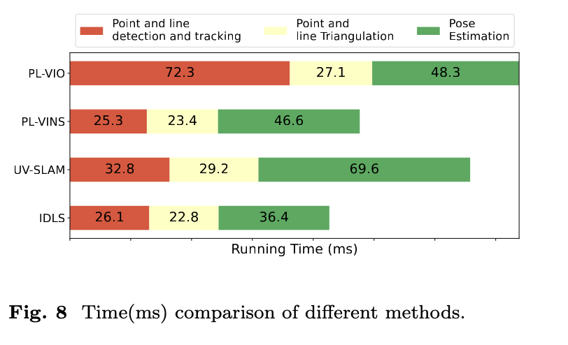

<h2 align = "center">
IDLS: Inverse Depth Line based Visual-Inertial SLAM
</h2>
<h4 align = "center" >
<a href="https://arxiv.org/abs/2304.11748"> Arxiv </a>
</h4>


Wanting Li^1^, Shuo Wang^1^, Yongcai Wang^1,*^, Yu Shao^1^, Xuewei Bai^1^, Deying Li^1^

^1^ School of Information, Renmin University of China, Beijing, 100872 


<center>
  <a href="colslam.pdf"> 
  </a>
  <a href="#">
  
  </a>  
  <a href="#">
  
  </a> 
</center>


<video controls="controls" autoplay="autoplay" src="IDLS.mp4" type="video/mp4"></video>


<h2 align = "center">
Overview 
</h2>
For robust visual-inertial SLAM in perceptually-challenging indoor environments,  recent studies exploit line features to extract descriptive information about scene structure to deal with the degeneracy of point features. But existing point-line-based SLAM methods mainly use Plücker matrix or orthogonal representation to represent a line, which needs to calculate at least four variables to determine a line. Given the numerous line features to  determine in each frame, the overly flexible line representation increases the computation burden and comprises the accuracy of the results. In this paper, we propose inverse depth representation for a line, which models each extracted line feature using only two variables, i.e., the inverse depths of the two ending points. It exploits the fact that the projected line's pixel coordinates on the image plane are rather accurate, which partially restrict the line.  Using this compact line presentation, Inverse Depth Line SLAM (IDLS) is proposed to track the line features in SLAM in an accurate and efficient way.  A robust line triangulation method and a novel line re-projection error model are introduced.  And a two-step optimization method is proposed to firstly determine the lines and then to estimate the camera poses in each frame. IDLS is extensively evaluated in multiple perceptually-challenging datasets.  The results show it is more accurate, robust, and needs lower computational overhead than the current state-of-the-art of point-line-based SLAM methods.

<h2 align = "center">
System Architecture 
</h2>
Based on the inverse depth line representation, the residue error function, and the initialization method, we integrate the inverse depth line features and develop IDLS. This section introduces the IDLS framework. IDLS contains three threads:  (1) measurement processing, which conducts IMU pre-integration, point, and line feature extraction ,matching and triangulation; (2) the Vision Inertial Odometry (VIO) thread, which calculates the camera ego-motion and point-line locations by graph optimization in a sliding window; (3) the loop closure thread, which uses the bag-of-words model of points to conduct loop detection and gragh optimization. 


<h2 align = "center">
Feature
</h2>


-   A two-parameter representation for a line based on the endpoints' inverse depth is presented. This method of representing line features eliminates redundant parameters for line features during pose estimation, thereby improving the efficiency of back-end optimization.

-   By redesigning the line feature triangulation method and the line feature reprojection error based on the inverse depth representation of line features, these were integrated into the existing point-based SLAM system VINS-MONO, utilizing the novel line feature representation throughout the entire process.

-   A two-step optimization method that reduces the computational complexity, making each optimization step easier to solve.

-   Experiments in EuRoc\cite{burri2016euroc} and real perceptually challenging datasets demonstrate that IDLS outperforms state-of-the-art algorithms in a variety of challenging circumstances.Simulated ablation experiments are also used to demonstrate the effectiveness of the inverse depth line feature representation in various processes of SLAM in degraded scenes.


<h2 align = "center">
Evaluations
<h2>





<h2 align = "center">
Bibtex
</h2>
```tex
@article{li2023idll,
  title={IDLL: Inverse Depth Line based Visual Localization in Challenging Environments},
  author={Li, Wanting and Shao, Yu and Wang, Yongcai and Wang, Shuo and Bai, Xuewei and Li, Deying},
  journal={arXiv preprint arXiv:2304.11748},
  year={2023}
}
```


<h2 align = "center">
Acknowledgment 
</h2>
This work was supported in part by the National Natural Science Foundation of China Grant No. 61972404, 12071478; Public Computing Cloud, Renmin University of China; Blockchain Laboratory, Metaverse Research Center, Renmin University of China.


